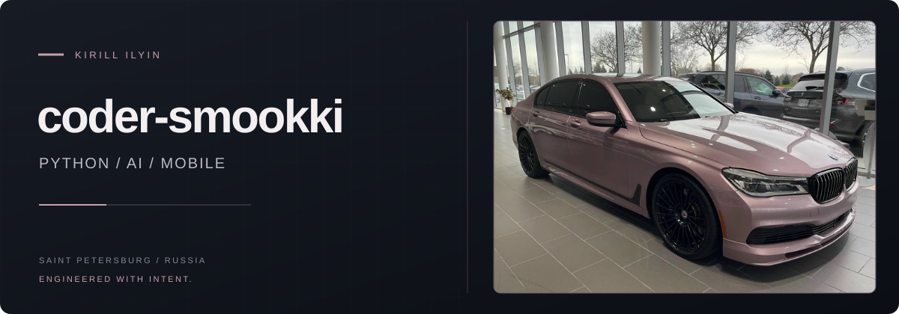
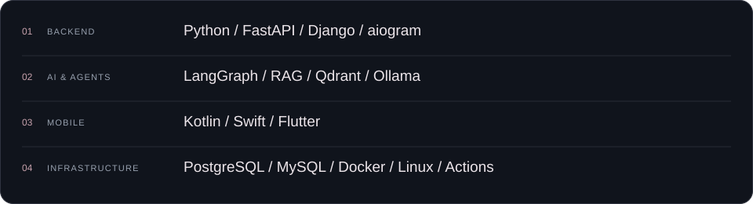
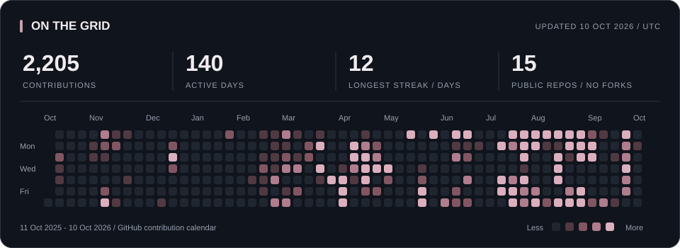

  

  
  &nbsp;
  
  &nbsp;
  
  &nbsp;
  

## Кирилл Ильин

**Fullstack-разработчик · AI Developer · Мобильный разработчик** 
Санкт-Петербург, Россия

Пишу бэкенд на Python, собираю AI-системы и выпускаю мобильные приложения. Сооснователь **[F-Rent](https://f-rent.ru/)** и основатель IT-агентства **Lumnex**. Работаю с продуктом целиком: от бизнес-логики и интеграций до интерфейса и релиза.

В коде люблю ясную архитектуру. В дизайне - графит, спокойные акценты и внимание к деталям.

## 01 / В работе

<table>
<tr>
<td width="50%" valign="top">
<h3><a href="https://f-rent.ru/">F-Rent</a></h3>

Маркетплейс аренды вещей. Платформа, мобильные приложения, платежи и фискализация. Релизы в App Store и RuStore.

Python · MySQL · Kotlin · Swift

</td>
<td width="50%" valign="top">
<h3><a href="https://github.com/Funora-Develop/Funora">Funora</a></h3>

Проектирую мультиязычный SDK и framework для FunPay: общий контракт, генерация моделей и единые тестовые векторы.

Open source · Python · Specification · В разработке

</td>
</tr>
<tr>
<td width="50%" valign="top">
<h3>AIst</h3>

Поиск по корпоративным регламентам на собственных серверах. Team Lead команды, занявшей 1-е место в IT-направлении PRO СТРОЙ 4.0.

LangGraph · Qdrant · Ollama · RAG

</td>
<td width="50%" valign="top">
<h3>Lumnex</h3>

IT-проекты для бизнеса: веб-сервисы, боты, автоматизация и мобильные приложения. От анализа задачи до запуска продукта.

Backend · Integrations · Web · Mobile

</td>
</tr>
</table>

## 02 / Под капотом

  <picture>
    <source media="(max-width: 600px)" srcset="assets/stack-mobile.svg" />
    
  </picture>

## 03 / Открытый код

| Проект | Что внутри |
| :--- | :--- |
| **[PyGame-DOOM-1993](https://github.com/coder-smookki/PyGame-DOOM-1993)** | 2.5D-шутер на Python: ray casting, текстуры, спрайты, коллизии и звук. |
| **[SMK Dealership](https://github.com/coder-smookki/website-dealership)** | Веб-платформа автосалона: объявления, модерация, заявки и панель управления. |
| **[SSD / Видеоконференции](https://github.com/coder-smookki/Hackathon-SSD-2024)** | Платформа видеосвязи с входом через Telegram WebApp. 2-е место на Хантатоне-2025. |
| **[Lord of the Empire](https://github.com/coder-smookki/YandexSkill_Game_Lord_of_the_Empire)** | Игровой навык для Яндекс.Алисы. 1-е место на хакатоне Яндекса в 2024 году. |

## 04 / На дистанции

  <a href="https://github.com/coder-smookki?tab=overview">
    <picture>
      <source media="(max-width: 600px)" srcset="assets/activity-mobile.svg" />
      
    </picture>
  </a>

Реальные данные GitHub. Обновление каждый день; дата среза указана на карточке. GitHub может учитывать приватный вклад без раскрытия репозиториев.

## 05 / За пределами репозиториев

- **PRO СТРОЙ 4.0, 2026** - 1-е место в IT-направлении, Team Lead команды AIst.
- **AI Challenge** - диплом победителя международного хакатона по искусственному интеллекту.
- **Хантатон** - 1-е место в 2024 году, 2-е место в 2025 году; наставник секции Junior с 2024 года.
- **Яндекс** - победы в хакатонах по разработке навыков для Алисы.

---

  <b>Давайте соберём следующий продукт.</b> 
  <a href="https://t.me/smokkkkiiii">@smokkkkiiii</a> &nbsp; / &nbsp; <a href="mailto:smookki@yandex.ru">smookki@yandex.ru</a>

  CV: <a href="cv/CV_RU.md">Русский</a> · <a href="cv/CV_EN.md">English</a> &nbsp; | &nbsp; PDF: <a href="cv/Kirill_Ilyin_CV_RU.pdf">RU</a> · <a href="cv/Kirill_Ilyin_CV_EN.pdf">EN</a>

